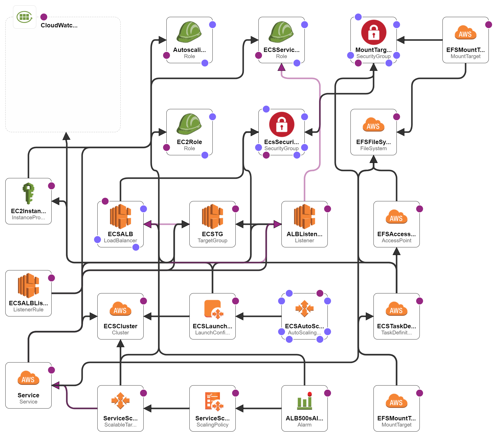

# Implantação de Cluster AWS ECS com WordPress usando AWS CloudFormation

Este modelo CloudFormation cria um cluster AWS ECS (Elastic Container Service) com um ALB (Application Load Balancer), um Grupo de Auto Scaling EC2 e recursos associados para hospedar uma aplicação WordPress em contêiner. O modelo está escrito no formato YAML do AWS CloudFormation e implanta a infraestrutura necessária para executar uma aplicação WordPress em contêiner na AWS ECS.

Projeto desenvolvido para disciplina de Infraestrutura como Código.

**Professor:** Renato Marques

**Colaboradores:** Gabriel Mai, Lucas Cavalcanti, Luciano Martins e Patrick Andrade

## Parâmetros
```bash
DesiredCapacity: O número de instâncias para iniciar no seu cluster ECS. O valor padrão é 1.
```

## Recursos

### Cluster ECS
- **ECSCluster**: Cluster AWS ECS.

### Definição de Tarefa ECS
- **ECSTaskDefinition**: Definição de tarefa ECS para o WordPress.

### Serviço ECS
- **ECSService**: Serviço ECS para a aplicação WordPress.

### Balanceador de Carga (ALB)
- **ECSALB**: AWS Application Load Balancer (ALB).
- **ALBListener**: Configuração do ouvinte do ALB.
- **ECSALBListenerRule**: Regra do ouvinte para o ALB.

### Dimensionamento Automático
- **ECSAutoScalingGroup**: Grupo de Auto Scaling para instâncias ECS.
- **ServiceScalingTarget**: Alvo de escalonamento de aplicação Auto Scaling.
- **ServiceScalingPolicy**: Política de escalonamento de aplicação Auto Scaling.
- **AutoscalingRole**: Função IAM para escalonamento automático.

### Armazenamento de Dados
- **EFSSystem**: Sistema de arquivos EFS (Elastic File System) para armazenar dados persistentes do WordPress.

### Recursos de VPC e Rede
- **MyVPC**: Recurso AWS VPC (Virtual Private Cloud).
- **InternetGateway**: Recurso AWS Internet Gateway.
- **AttachGateway**: Anexa o Internet Gateway ao VPC.
- **PublicSubnet1** e **PublicSubnet2**: Sub-redes públicas em diferentes Zonas de Disponibilidade.
- **EcsSecurityGroup**: Grupo de segurança para instâncias ECS.
- **ContainerInstances**: Configuração de inicialização para instâncias ECS.
- **EC2Role**: Função IAM para instâncias EC2.
- **EC2InstanceProfile**: Perfil de instância IAM para instâncias EC2.


## Uso

Para implantar este modelo CloudFormation:

1. Acesse o Console de Gerenciamento da AWS.
2. Acesse o serviço CloudFormation.
3. Crie um novo empilhamento e faça o upload deste modelo YAML.


## Exemplos de Resultados



Exemplo da estrutura criada pela stack no CloudFormation